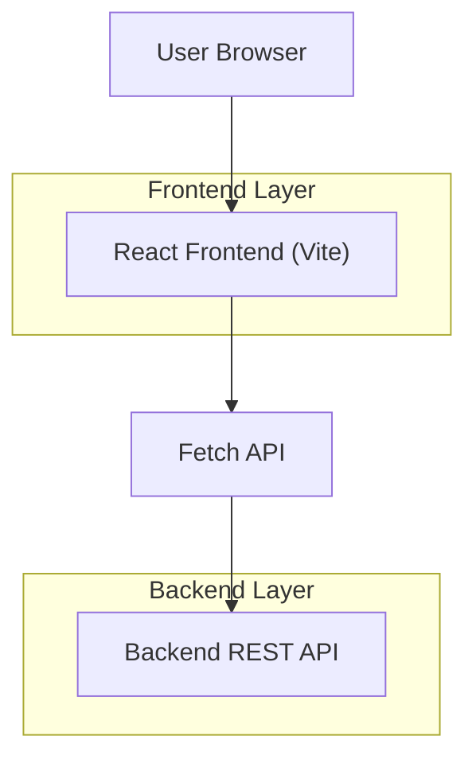

## 1.Architecture design


## 2.Technology Description
- Frontend: React@19 + react-router-dom@7 + react-icons@5 + Vite@6
- Styling: Plain CSS files per page + global CSS (tailwindcss is installed but not currently used in the UI)
- Backend: Existing REST API (consumed via `fetch`) 

## 3.Route definitions
| Route | Purpose |
|-------|---------|
| /login | Log in to access the app |
| /create | Create a new account |
| / | Home dashboard for primary actions (protected) |
| /log | Create a “three good things” entry (protected) |
| /pastentries | Find and view a past entry by date (protected) |
| /about | About content (protected) |
| * | Not found (protected) |

## 4.API definitions (If it includes backend services)
### 4.1 Core API
Authentication related
```
POST /api/users/create
POST /api/users/login
```
Logs related
```
POST /api/logs/create
GET /api/logs/get?userId={userId}&date={MM-DD-YYYY}
```

Common response shapes (as used by the frontend)
```ts
type ApiError = { error: string };

type LoginResponse =
  | ApiError
  | { message: "Login successful"; user_id: string };

type CreateAccountResponse =
  | ApiError
  | { message: "Account created"; user_id: string };

type CreateLogResponse =
  | ApiError
  | { message: string };

type GetLogResponse =
  | ApiError
  | {
      message: "Log found successfully";
      log: { body: { thing_1: string; thing_2: string; thing_3: string } };
    };
```

## 6.Data model(if applicable)
Frontend-only: data model is implied by API responses; no client-side database.
