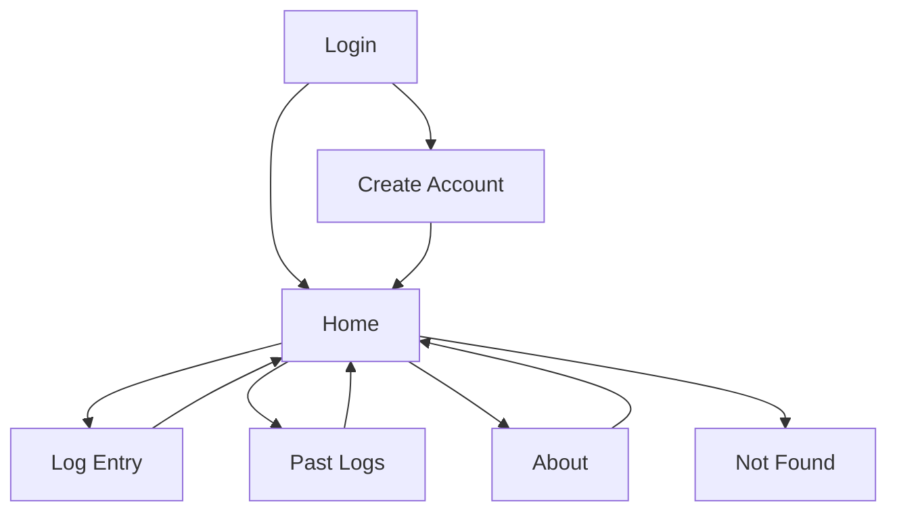

## 1. Product Overview
Three Good Things is a simple journaling app where you log 3 positive moments and later look them up by date.
This document scopes a modern UI/UX refinement while keeping the existing color scheme and overall layout.

## 2. Core Features

### 2.1 User Roles
| Role | Registration Method | Core Permissions |
|------|---------------------|------------------|
| Logged-out Visitor | N/A | Can create an account, log in |
| Logged-in User | Username + password (plus email on signup) | Can view Home/About, create a log, find past logs, log out |

### 2.2 Feature Module
Our UI/UX refinement requirements consist of the following main pages:
1. **Login**: centered authentication card, inputs and primary CTA.
2. **Create Account**: centered account creation card, inputs and primary CTA.
3. **Home**: welcome hero, two primary actions, logout action.
4. **Log Entry**: three-textarea entry layout, save action and feedback.
5. **Past Logs**: date input cluster, find action, results presentation.
6. **About**: readable content layout.
7. **Not Found**: error message and safe navigation.

### 2.3 Page Details
| Page Name | Module Name | Feature description |
|-----------|-------------|---------------------|
| All pages | Visual consistency | Apply shared design tokens (spacing, radius, shadows, typography) while preserving current palette and page structure. |
| All pages | Accessibility & states | Improve focus visibility, hover/active states, disabled/loading states, and tap targets without changing navigation structure. |
| Navigation | Header & menu | Keep current top navigation but refine spacing, alignment, active link styling, and dropdown menu clarity. |
| Login | Auth card | Present inputs with labels/assistive text, inline validation styling (visual only), and a clear primary button. |
| Create Account | Auth card | Match Login card styling, input spacing, and button hierarchy for a consistent onboarding feel. |
| Home | Primary actions | Keep centered layout; refine button hierarchy (2 primary actions + separate destructive logout styling). |
| Log Entry | Entry layout | Keep 3-box layout; refine textarea styling, add clearer numbering/labels, and reinforce “Save” feedback states (visual only). |
| Past Logs | Lookup form + results | Keep MM/DD/YYYY input model; refine grouping, helper text, empty state, and result container readability. |
| About | Content readability | Keep text content; improve line length, spacing, and content surface for long-form readability. |
| Not Found | Recovery | Keep message; add clear “Back to Home” affordance for logged-in users. |

## 3. Core Process
**Logged-out flow**: You land on Login → you log in → you go to Home.
**Account creation flow**: You go to Create Account → you submit details → you land on Home.
**Daily logging flow**: You go to Home → “Log Three Good Things” → you enter 3 items → Save → you return/continue.
**Review flow**: You go to Home → “Look at Past Entries” → you enter a date → Find → you view results.
**Logout flow**: You log out from Home → you return to Login.

